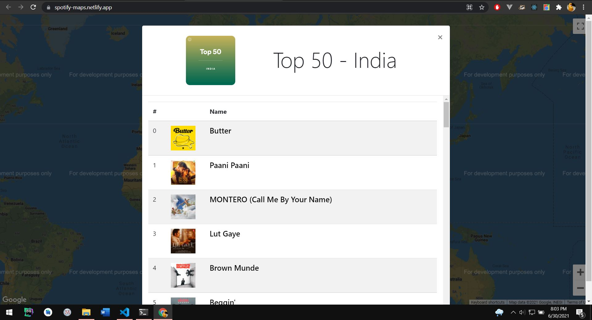

# Spotify Maps

### _Click on the Country and Get the Top 50 Songs of Country by Spotify Charts_

This idea finally came to reality :)

I used this [repo](https://github.com/arturssmirnovs/Clickable-countries-using-Google-Maps-API) to make the Clickable Country in Google Maps.

## Demo

- ### [Netlify Demo](https://spotify-maps.netlify.app/)

- 

- 

## Run Locally

    _will update soon_
    _maybe not :P_
